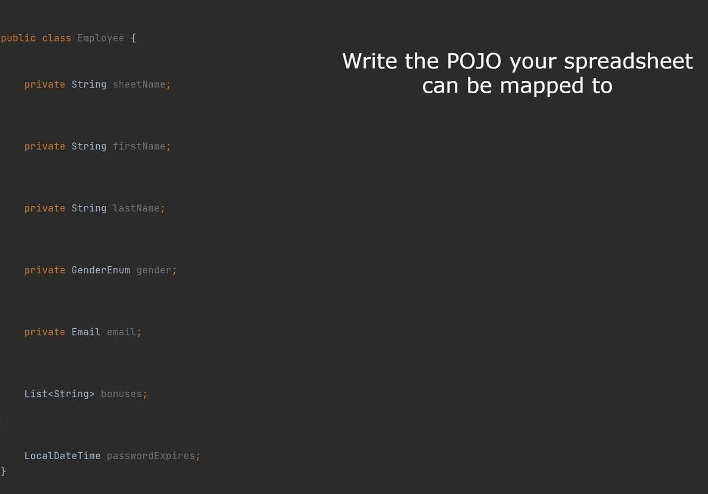

About this
===========
**Spreadsheet Importer** is a **library** that was born out of my perceived need to have an easy way of not only
importing well formatted and prepared data but also of validating the contents of the file. The reality is that often
times the source of a spreadsheet may lack technical or even business knowledge and expecting such a source to produce a
perfect file is unreasonable. Using this library you *should* have a better chance of catching problems while also
spending less time writing code and thinking of all possible combination of factors (of which there are many).

After you parse a file you can access all the problems, predefined in the library or business specific and then return
them to the user. No more generic messages like "The file is invalid" when you have thousands of rows and no idea what's
the problem. Using this library you will be able to return a list of specific problems down to a single row and column.
The library is designed to allow any developer an easy way of adding custom validations or business specific logic.

You as a programmer are free to treat the imported data as you see fit. You can make it a best-effort and take only the
valid rows or ignore everything if there's even a single validation problem. You can even consume the rows as they are
being imported.

The library uses **annotation processing**. This means that most of the magic happens at **compile time**. This gives a
better runtime performance and is also typesafe.

On top of standard importing functionalities, this also provides support for **dynamic column ordering**, **regex column
and spreadsheet recognition**, **metadata injection** (like spreadsheet name/index or grouping all unmatched columns
inside a map) as well as **many other features**.



Features
===========

- Based on **annotation processing**, the magic happens at compile time increasing **runtime performance** and being **
  type-safe**;
- Works both with ```xlsx``` and ```xls```;
- Importing any of the following: String, Boolean, Byte, Short, Integer, Long, Float, Double, Enums, LocalDateTime,
  LocalDate, LocalTime as well as custom classes having a public constructor accepting a String;
- "Importing" extra data such as the sheet name, sheet index, row number, the index of the row or importing all the
  columns that were not otherwise matched;
- Importing **formula results**;
- **Ordinal imports** (based on the index of the row/sheet, header is optional);
- **Named imports** (based on the name of the column/sheet or a regex);
- Importing multiple columns(that match a regex) as a list;
- Column presence validation (min/max number of times a column can be found);
- **Dynamic column ordering**(no more columns must be in this exact order for this to work);
- **Predefined validations** down to the column level: not null, matches regex, are formulas allowed;
- Custom **static validations** down to the row level;
- Custom **dynamic validations** down to the row level (can be used to check against a database or against an external
  system);
- Real-time **hooks** with for the mapped rows (valid/invalid/all, including the validation problems for each one);
- Allows **processing** a cells value before it is imported allowing you to change things such as regional
  particularities or other specific things;
- Access valid/invalid rows, validation problems for a specific row or all rows that have a specific validation problem;
- Ability to return to the user of list of problems, so they can know what is wrong and correct the problems;
- Ability to **customize those messages** (like in other languages);
- **IoC** compatible (can be integrated and tested/mocked inside an **IoC** environment like **Spring**);
- Most functionalities should be covered by integration tests;

**Planned (possibly)**:

- Being able to split column values into a list of basic java types;
- Don't store state, use only the hooks to allow large file imports (using ```com.monitorjbl.xlsx-streamer```);
- Support password-protected files;
- Min, Max, Length validations?;
- Injecting a map/list of the columns/field names that are invalid;

Instalation
===========
From **Maven central**:
```
    <dependency>
        <groupId>ro.nom.vmt</groupId>
        <artifactId>spreadsheet-importer</artifactId>
        <version>0.1.0</version>
    </dependency>    
```

How to use
===========

1. Create the class that matches the data you want to import:

```
// getters & setters are ommited

public class Employee{  
    private String firstName;      
    private String lastName;
    private GenderEnum gender;
    private Byte age;
    private Email email;
    private String phone;
    private Integer salary;
    private Boolean isMarried;
    List<String> bonuses;
    LocalDateTime lastLogin;
    LocalDate hiredOn;
    LocalTime startsWorkAt;
    LocalDateTime passwordExpires;
}
```

2. Annotate the class using ```@Importable```

| Options ```@Importable``` |   Type   | Default | Explanation                                                                                                                                                                  |
| ------------------------- | :------: | :-----: | :---------------------------------------------------------------------------------------------------------------------------------------------------------------------------:|
| isNamed                   | boolean  |  false  | Whether the fields inside the class will be imported based on the column names or column positions                                                                           |
| hasHeader                 | boolean  |  true   | If ```isNamed``` is ```false``` this is used to specify if the excel rows include a header or not. If ```true``` then a header must be present                               |
| sheetIndexes              | int[]    |   {0}   | This specifies the indexes of the sheets that contain the data. By default it will import only from the first sheet                                                          |
| sheetNames                | String[] |   { }   | This specifies the name(s) or **regular expresion(s)** used to determine the sheets to import data from. If this is set the *default* value of ```sheetIndexes``` is ignored |

E.g.:

```
   @Importable(isNamed = true, sheetNames = {"London.*"}) //will use the column names and will import from all sheets mathing the regex (e.g.: "London E" and "London W")
   public class Employee{
```

3. Annotate the fields you want to import using ```@Import``` and ```@Named``` or ```@Ordinal``` depending on the value
   you used for ```isNamed```. (You can't combine both named and ordinal imports inside the same class)

You can import the following:

* **Standard java types**: ```String```, ```Byte```, ```Short```, ```Integer```, ```Long```, ```Float```, ```Double```
  , ```Boolean```[^1], ```LocalDateTime```, ```LocalDate```, ```LocalTime```;
* **Enums** (using the ```valueOf``` method of the enum class; If no enum exists for the string the value and row will
  be considered invalid; You could use ```@PreProcess``` combined with ```DefaultEnumProcessor``` on enum fields to
  better match the fields);
* **List of standard java types** (if you use named imports you can get a list with all the values from the columns
  matching the name);
* **Map** with the value a standard java type and the key either an Integer or a String. The keys are the index/names of
  the columns matching the regex and the value is the content found in the respective column;
* **Any other class** having a public constructor taking a String as a parameter. To pass back specific validation
  errors throw an ```InstantiationProblem```. If this or any other exceptions are thrown the value and row will be
  considered invalid;

| Options ```@Import``` |  Type                                 | Default | Explanation                                                                                                                                                                                                                                                                                                                                                                                                                         |
| --------------------- | :-----------------------------------: | :-----: | :---------------------------------------------------------------------------------------------------------------------------------------------------------------------------------------------------------------------------------------------------------------------------------------------------------------------------------------------------------------------------------------------------------------------------------: |
| required              | boolean                               |  false  | Whether the **value** associated with this field must be present in order for it and the row to be considered **valid**. Empty strings (```String::isEmpty```) are interpreted as null since a normal user editing an excel cannot really differentiate between the 2 cases                                                                                                                                                         |
| trim                  | boolean                               |  true   | If set to ```true``` then the input is trimmed of spaces (uses ```String::trim```). This happens after ```@PreProcess``` and before the **regex** check                                                                                                                                                                                                                                                                             |
| formulaAllowed        | boolean                               |  true   | If formulas can be present in the cell and if yes, they will be evaluated and then the result will continue as normal. When used with Temporal fields support may be only partial especially if used with ```matches```                                                                                                                                                                                                             |
| matches               | String                                |   ""    | Specifies the regular expression that a column must match in order for the value and row to be considered valid (uses ```String::matches```). This is checked **after** the optional **trim** and optional ```@PreProcess```. <br />For temporal fields (```LocalDateTime```, ```LocalDate``` and ```LocalTime```) this column specifies the format to pass to ```DateTimeFormatter.ofPattern``` if the column is a string in excel |
| preProcess            | Class<? extends ColumnPreProcessor>[] |   {}    | The class for an implementation of the ColumnPreProcessor interface. This will be used to process the string value if needed. You can remove special characters, replace letters or any other operation. You can use multiple processors but generally one will probably be enough. If multiple processors are used, they are applied sequentially in the order they are given.                                                     |

| Options ```@Named``` |  Type  | Default | Explanation                                                                                                                                                                  |
| -------------------- | :----: | :-----: | :--------------------------------------------------------------------------------------------------------------------------------------------------------------------------: |
| value                | String |         | The name or regular expression to look for in the header                                                                                                                     |
| minimumMatches       |   int  |    1    | The minimum number of times that columns matching the name must be found in order for the file to be valid                                                                   |
| maximumMatches       |   int  |    1    | The maximum number of times that columns matching the name must be found in order for the file to be valid. Can't be 0 and if greater than 1, the field must be a collection |

| Options ```@Ordinal``` | Type  | Default | Explanation                                                              |
| ---------------------- | :---: | :-----: | :----------------------------------------------------------------------: |
| value                  |  int  |         | The index of the column this field should be imported from (starts at 0) |

E.g.:

```
@Ordinal(4)
@Import(required = true, matches = EMAIL_REGEX)
private Email email; //this is a custom class with a public constructor taking a String
```

```
@Named("Gender")
@Import
private GenderEnum gender;
```

```
@Named("Bonus.*")
@Import
List<String> bonuses;
```

```
@Named("Bonus.*")
@Import
Map<String,String> bonusesMap1;
```

```
@Named(value = "Non existent column", required = false)
@Import
private Boolean nonExistentColumn;
```

```
@Named("Password expires")
@Import(matches = "yy-MM-dd_HH:mm")
LocalDateTime passwordExpires;
```

4. (Optional) For special use cases you can also "Inject" certain information inside your object using ```@Inject```

| Options ```@Inject``` | Type       | Default | Explanation                                                                                                                                                                                                                                                                                                                                                                                                                                                                                                                                                                                                                                                                                                                                                                |
| --------------------- | :--------: | :-----: | :------------------------------------------------------------------------------------------------------------------------------------------------------------------------------------------------------------------------------------------------------------------------------------------------------------------------------------------------------------------------------------------------------------------------------------------------------------------------------------------------------------------------------------------------------------------------------------------------------------------------------------------------------------------------------------------------------------------------------------------------------------------------: |
| value                 | InjectType |         | Enum with the following values:<br/> ```IMPORT_INDEX```: For ```Integer``` fields this will set the index of the row irrespective of the sheet. Starts at 1 and will be unique for each row imported. Even invalid rows get an index; <br/>```ROW_NUMBER```: For ```Integer``` fields, sets the number of the row in the sheet (starts at 0);<br/>```SHEET_NAME```: For ```String``` fields, sets the sheet name the row is present in. Useful when using regex for the sheet name;<br/>```SHEET_INDEX```: For ```Integer``` fields, sets the sheet index (starts from 0) the row is present in. Useful when using regex for the sheet name; <br/>```UNMATCHED_COLUMNS```: For ```Map<String, String>``` fields, this gathers all columns that were not otherwise matched; |

5. Create **public setters** for **all** the fields you want to import or inject based on the ```setColumnName``` format
   accepting a single parameter of the same type as the field;

6. (Optional) If you need cross validation (e.g.: if x field is null then y field must also be null) or more complex
   static validations not covered by the annotations you can have your mapped class implement ```Validatable``` and use
   the ```validate``` method to return a list of validation problems;

7. Build the project in order for the annotations to be processed and the mapper to be generated (The mapper will have
   the same package as your class and the name will have "ImportMapper" appended);

8. Create a new instance of ```Importer``` passing the class of the generated mapper; You could even make a bean out of
   it if using this alongside dependency injection;   
   E.g.:

```
Importer<Employee> importer=Importer.build(EmployeeImportMapper.class);
``` 

9. (Optional) If you want to do even more advanced validations (non static, e.g.: check a value is present in a
   database) you can use the builder (```Importer.builder(EmployeeImportMapper.class)```) and add validators to the
   importer using ```.withValidator(validator)``` where ```validator``` is of
   type ```Function<T, List<ValidationProblem>>```; Mutating the object here is NOT encouraged or supported;

10. (Optional) For "hooks" that get called for valid/invalid/all rows you can use ```.withConsumerForValid```
    ,```.withConsumerForInvalid``` or ```.withConsumer```; At the time the "hooks" are called the validity of the object
    was already determined; Mutating the object here is NOT encouraged or supported;

11. After everything is set up, you can call ```.process``` (with ```.build()``` before if youa dded extra options) and
    provide an ```InputStream``` of the excel file; This will return an immutable[^2] instance of
    type ```ImportData<T>``` that will contain the imported data and the validation problems;

12. Access what you need from ```ImportData<T>```:

```
    public boolean isValid();
    
    public List<T> getValidRows();
    public List<T> getInvalidRows();
    public List<T> getInvalidRows(Class<? extends Problem> validationProblemClass);
    public List<T> getAllRows();

    public long getRowNoTotal();
    public long getRowNoValid();
    public long getRowNoInvalid();

    public List<Problem> getValidationProblems();
    public List<RowProblem> getValidationProblems(T data);
    public List<Problem> getValidationProblems(Class<? extends Problem> clazz);
    public List<Problem> getValidationProblemsTree(Class<? extends Problem> clazz);
```

Extra step (optional):
If you are using an **IoC** framework (like **Spring**) the ```Importer``` can function as a ```Bean``` since it does
not change state across imports:

```
    @Bean
    public Importer<Employee> getImporterEmployee(EmployeeService employeeService) {        
        return Importer.builder(EmployeeNamedImportMapper.class)                
                .withValidator(employeeService.getImportValidator())
                .withConsumerForValid(employeeService.getKafkaConsumer());
                .build();
    }
```

Compatibility
===========
Designed to work both with ```xlsx``` and ```xls``` files thanks to ```apache-poi```;

The library targets **Java 8** and tries to keep dependencies at a minimum;

The library uses ```org.apache-poi:5.0.0``` (latest as of writing this). I found that there can be problems if you or
another of your dependency are using an older version that provides older jars like ```ooxml-schemas-1.4.jar```. Don't
ask me why but if you need to include the apache-poi dependencies in your POM in order to upgrade the version, try to
include them among the top of your dependencies;

Due to **Lombok** using annotation processing in unintended ways (changing existing classes instead of strictly
generating new ones) importing classes that have the setters generated with Lombok may create problems if this library
gets to process its annotations before Lombok. I've found the problem between Lombok and other libraries using
annotation processing in the past too. For me the solution was to put the lombok dependency first in my pom but that may
not be that safe or work for in every situation. Worst case scenario, use the IDE to generate your setters or write them
manually.

Testing
===========
Most if not all the features of this library should be covered by **integration tests** (see the test folder). This
allows safer development and more reliable code however it is hard to cover all combinations of annotations used,
settings and most importantly the state of the provided excel.   
If you end up using this, I suggest you write your own integration tests for your specific POJOs. Given the way the
library works this shouldn't take you long so no excuse not to have this covered by tests too. Tests are also a great
way to **contribute** to this if you want to. Adding your specific POJOs and dummy data can help improve the quality of
this library.

Contact
===========
If you want to reach out about this repository you can find me at: spreadsheet.importer (at) vmt.nom.ro. **No support**
via email, for bugs please open an issue.

License - MIT
===========

**Copyright**  (c) 2021 - Mihai Vasile

Permission is hereby granted, free of charge, to any person obtaining a copy of this software and associated
documentation files (the "Software"), to deal in the Software without restriction, including without limitation the
rights to use, copy, modify, merge, publish, distribute, sublicense, and/or sell copies of the Software, and to permit
persons to whom the Software is furnished to do so, subject to the following conditions:

The above copyright notice and this permission notice shall be included in all copies or substantial portions of the
Software.

THE SOFTWARE IS PROVIDED "AS IS", WITHOUT WARRANTY OF ANY KIND, EXPRESS OR IMPLIED, INCLUDING BUT NOT LIMITED TO THE
WARRANTIES OF MERCHANTABILITY, FITNESS FOR A PARTICULAR PURPOSE AND NONINFRINGEMENT. IN NO EVENT SHALL THE AUTHORS OR
COPYRIGHT HOLDERS BE LIABLE FOR ANY CLAIM, DAMAGES OR OTHER LIABILITY, WHETHER IN AN ACTION OF CONTRACT, TORT OR
OTHERWISE, ARISING FROM, OUT OF OR IN CONNECTION WITH THE SOFTWARE OR THE USE OR OTHER DEALINGS IN THE SOFTWARE.

**[^1]**: For boolean values strings are trimmed, upper-cased and then the following are mapped to ```true```: "TRUE", "
1", "T", "Y", "YES" and the following to ```false```: "FALSE", "0", "F", "N", "NO"; Any other value will be considered
invalid together with the row;  
**[^2]**: Apart from the instances of the user provided class ```<T>```, the ```ImportData``` instance **is intended**
to be immutable at the time the developer gets access to it (the instance can and is mutated internally by the library
before it is provided to the dev);
